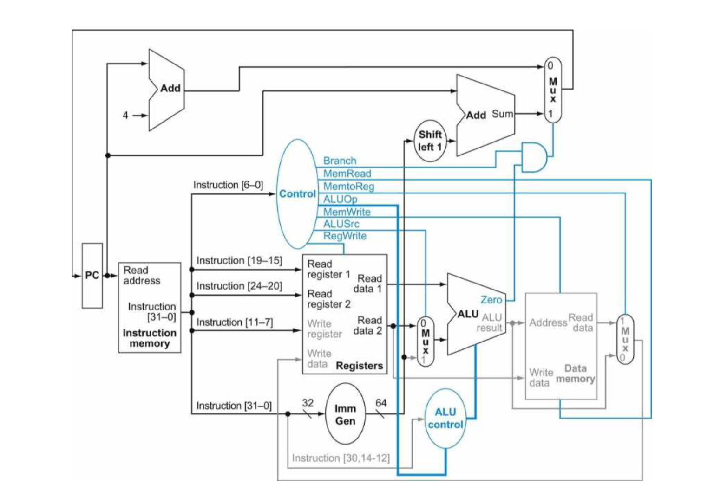

# 《计算机组成与系统设计》综合实验报告

        

         成员信息：

[TOC]

###### 前言：

         该处理器的设计前前后后涉及了三个版本，最后采用时序逻辑与组合逻辑交叉的结构，完成本次实验报告。关于学长给的流水线示例，非常遗憾，没有仔细阅读，认真实践，导致前两个版本出现各种各样的问题。Verilog文法是问题的关键。实验起初，大家仔细阅读书上处理器数据通路章节，完全凭自己的智慧和勇气完成整体框架的搭建，然而关于整体的策划略有不足。最后实现了整体流水线数据通路，甚至对书上所讲略有补充，当然，更多的是根据自己思想的改动。在此，十分感谢大家的努力，谢谢大家！

###### **关键词：**

**riscv**  **if**  **id**  **ex**  **mem**  **wb**  **流水线冒险 数据前递 流水线停顿**

### 1.问题定义与成果：

    实现riscv五级流水线，暂时完成26条指令，具有流水线冒险机制，能够完成数据前递，流水线停顿。并设定了标志寄存器。云平台运行正确。总体目的在于理解riscv cpu设计，理解时序逻辑与组合逻辑的混合使用，理解流水线的工作机制和冒险机制。

### 2.总体设计原则

###### version1.1

```plai
    各个模块采用时序逻辑，指令寄存器和riscv模块，存储器处于同一级，没有严格意义上的流水线寄存器，根据书上数据通路，实现整体框架。
```

###### version1.2

```
    采用时序逻辑和组合逻辑相结合，if模块和各个流水线寄存器模块使用时序逻辑，其他模块使用组合逻辑。拥有严格的流水线寄存器，严格的数据流向，保证模块输入数据的正确性和流水线的稳定性。
```

###### version1.3

```
    在version1.2的基础上，增加标志寄存器，扩展控制线，扩充指令，实现流水线停顿，数据前递，插入空指令等操作，使ld指令，beq指令等能够得到正确的结果，消除冒险行为。
```

### 3.总体设计

#### 3.1总体五级流水线数据通路



#### 3.2参考书上数据通路id模块，控制器模块


###### R型指令

| 指令  | 31：25   | 24：20 | 19：15 | 14：12  | 11：7  | 6：0     |
| --- | ------- | ----- | ----- | ------ | ----- | ------- |
|     | Funct7  | Rs2   | Rs1   | Funct3 | rd    | opcode  |
| Add | 0000000 | 00011 | 00010 | 000    | 00001 | 0110011 |

###### I型指令

| 指令   | 31：20        | 19：15 | 14：12  | 11：7  | 6：0     |
| ---- | ------------ | ----- | ------ | ----- | ------- |
|      | Immediate    | Rs1   | Funct3 | Rd    | Opcode  |
| Addi | 001111101000 | 00010 | 000    | 00001 | 0010011 |
| Ld   | 001111101000 | 00010 | 011    | 00001 | 0000011 |

###### S型指令

| 指令  | 31：25     | 24：20 | 19：15 | 14：12  | 11：7      | 6：0     |
| --- | --------- | ----- | ----- | ------ | --------- | ------- |
|     | immediate | Rs2   | Rs1   | Funct3 | immediate | opcode  |
| sd  | 0000000   | 00001 | 00010 | 010    | 00000     | 0110011 |

###### SB型指令

| 指令  | 31：25     | 24：20 | 19：15 | 14：12  | 11：7      | 6：0     |
| --- | --------- | ----- | ----- | ------ | --------- | ------- |
|     | immediate | Rs2   | Rs1   | Funct3 | immediate | opcode  |
| beq | 0011111   | 00001 | 00010 | 001    | 01000     | 0110011 |

#### 3.4数据前递


        

        解决数据冒险的方法之一就是数据前递，具体实现方法是在ex阶段增加多路选择器，使ex/mem寄存器和mem/wb寄存器中保存的ALU_result递交到ex多路选择器，与ALU_result的寄存器地址比较，相同则数据前递。

#### 3.4流水线停顿


        主要用于ld指令产生的冒险。在ex阶段多路选择器中，如果发现与在ex/mem寄存器中ld指令产生的ALU_result地址相等，则流水线停顿。

#### 3.5插入空指令

        用于分支跳转指令，减少控制线和引脚的使用，理论而言可使用分支预测，我们为应对分支跳转产生的冒险，采用插入空指令的方法，解决冒险。

### **4.详细模块设计（主要模块）**

        

#### 4.1 IF模块

**模块功能**    输出pc值

**实现思路**  

        输入跳转指令和mux信号，内部含有pc_reserve自增寄存器，得到将要输出的pc值，通过空指令控制信号和流水线停顿信号，得到最终输出值

**主要引脚及控制信号**  

input_PCSrc：        跳转控制信号

Input_pc:                 将要跳转到的pc

Pc_non_control:     插入空指令控制信号

Pc_stop:                  流水线停顿控制信号

Ce:                           指令存储器使能信号

Pc:                            输出pc值

**主要实现代码**  

```c
module IF(
    input clk,
    input rst_n,
    input[31:0] input_pc,
    input input_PCSrc,
    input pc_nop_control,
    input pc_stop,
    output[31:0] pc,
    output reg ce
    );
reg[31:0] pc_copy;
reg[31:0] pc_reserve;
reg i;
always @(posedge clk or negedge rst_n)begin
    if(~rst_n)begin
        i <= 1'b0;
        ce <= 1'b0;
        pc_reserve[31:0] <= 32'h0000_0000;
        pc_copy[31:0] <= 32'h0000_0000;
     end
     else begin
        if(i)begin
            pc_copy[31:0] <= 32'h0000_0000;
            i <= 1'b0;
        end 
        else begin
        i <= 1'b0;
        ce <= 1'b1;
        if(pc_stop)begin
            pc_copy[31:0] = pc_reserve - 4;
        end
        else if(pc_nop_control)begin
            pc_copy[31:0] = 32'h0000_0000;
            i <= 1'b1;
        end
        else begin
            pc_reserve <= pc_reserve + 4; 
            pc_copy <= pc_reserve;
        end
        end
    end
end
// 这用上升沿 因为 不可能连续停顿两次 可能与上边冲突
//always @(posedge pc_stop)begin
//    pc_reserve = pc_reserve - 4;
//    pc_copy[31:0] = pc_reserve;
//end 
//// 这也一样， 因为 beq指令后边是nop  会变成低电平
//always @(posedge pc_nop_control)begin
//    pc_copy[31:0] <= 32'h0000_0000;
//    i <= 1'b1;
//end
wire[31:0] pc_wire = pc_copy;
wire[31:0] pc_;
MUX MUX0(
    //.clk(clk),
    .rst_n(rst_n),
    .input_data0(pc_wire),
    .input_data1(input_pc),
    .input_control(input_PCSrc),
    .output_data(pc_)
);
//always @(negedge rst_n)begin        //澶嶄綅
//        pc_copy[31:0] <= 32'h0000_0000;
//end
assign pc = pc_;
endmodule
```

#### 4.2 ID模块


**模块功能**    译码

**实现思路**

        内部实现控制器和寄存器堆，立即数生成功能，输入instruction，得到各个寄存器，立即数和控制信号的值，作用于其他各个阶段。

**主要引脚与控制信号**

Input_wb_control: 写回寄存器控制信号

Input_wb_single:   写回寄存器地址

Input_wb_data:     写回寄存器内容

Instruction:            输入指令

Id_imm:                  输出32位立即数

Id0:                          输出寄存器0内容

Id1:                          输出寄存器1内容

Id0_addr:                输出寄存器0地址

Id1_addr:                输出寄存器1地址

Pc_nop_control:    输出插入空指令控制信号

T_ex_ALU_control:输出ALU控制信号

T_ex_control:         输出控制信号

T_ex_reg_addr:      输出写回寄存器地址

**实现代码**

```c
module ID(
    input rst_n,
    input[31:0] instruction,
    input[31:0] input_pc,
    input[4:0] input_wb_single,
    input[31:0] input_wb_data,
    input input_wb_control,
    output[31:0] t_ex_pc,
    output[7:0] t_ex_control,
    output[31:0] id0,
    output[31:0] id1,
    output[4:0] id0_addr,
    output[4:0] id1_addr,
    output[31:0] id_imm,
    output[4:0] t_ex_ALU_control,
    output[4:0] t_ex_reg_addr,
    output reg pc_nop_control
    );
reg[6:0] temp;
reg[31:0] t_ex_pc_copy;
reg[7:0] t_ex_control_copy;
reg[4:0] t_ex_ALU_control_copy;
reg[31:0] t_ex_reg_addr_copy;
wire[4:0] read_id0 = instruction[19:15];
wire[4:0] read_id1 = instruction[24:20];
assign id0_addr = read_id0;
assign id1_addr = read_id1;
reg reg_en;
always @ (*)begin
    temp[6:0] <= instruction[6:0];            // temp = 000 01100
    if(~rst_n)begin
        t_ex_control_copy <= 8'h00;
        t_ex_ALU_control_copy <= 5'b00000;
        t_ex_pc_copy <= 32'h0000_0000;
        t_ex_reg_addr_copy <= 5'b00000;
        temp <= 7'b000_0000;
        reg_en <= 1'b0;
        pc_nop_control <= 1'b0;
    end
    else begin
        pc_nop_control <= 1'b0;
        t_ex_pc_copy <= input_pc;
        t_ex_reg_addr_copy[4:0] <= 5'b00000;
        case(temp)
            7'b0000000 :begin   //空指令  各个控制信号都是空
                t_ex_control_copy[7:0] <= 8'b0000_0000;
                reg_en <= 1'b0;
            end
            7'b0110011 :begin            //
                t_ex_reg_addr_copy[4:0] <= instruction[11:7];
                t_ex_control_copy[7:0] <= 8'b00100010;
                t_ex_ALU_control_copy[4:0] <= {instruction[30],instruction[24], instruction[14:12]};
                reg_en <= 1'b1;
            end
            7'b0100011 :begin
                t_ex_control_copy[7:0] <= 8'b10001000;   //sd
                t_ex_ALU_control_copy[4:0] <= {0,0, instruction[14:12]};
                reg_en <= 1'b1;
            end
            7'b0000011 :begin
                t_ex_reg_addr_copy[4:0] <= instruction[11:7];
                t_ex_control_copy[7:0] <= 8'b11110000;
                t_ex_ALU_control_copy[4:0] <= {0 , 0, instruction[14:12]};
                reg_en <= 1'b1;
            end
            7'b1000011 :begin   // <><><>
                t_ex_reg_addr_copy[4:0] <= instruction[11:7];
                t_ex_control_copy[7:0] <= 8'b10100010;
                t_ex_ALU_control_copy[4:0] <= {0,0, instruction[14:12]};
                reg_en <= 1'b1;
            end
            7'b1100011 :begin //beq
                t_ex_control_copy[7:0] <= 8'b00000101;
                t_ex_ALU_control_copy[4:0] <= {0,0, instruction[14:12]};
                reg_en <= 1'b1;
                pc_nop_control <= 1'b1;
            end
        endcase
    end
end
assign t_ex_pc = t_ex_pc_copy;
assign t_ex_control = t_ex_control_copy;
assign t_ex_ALU_control = t_ex_ALU_control_copy;
assign t_ex_reg_addr = t_ex_reg_addr_copy;

/* */
Regfile Regfile0(
    .rst_n(rst_n),
    .reg_en(reg_en),
    .reg_write(input_wb_control),
    .write_reg_data(input_wb_data),
    .write_reg_addr(input_wb_single),
    .reg_control(t_ex_control[4]),
    .read_reg0_addr(read_id0),
    .read_reg1_addr(read_id1),
    .read_reg0_data(id0),
    .read_reg1_data(id1)
);

ImmGen ImmGen0(
    .rst_n(rst_n),
    .instruction(instruction),
    .control(temp),
    .imm(id_imm)
);
endmodule
```

#### 3.3 EX模块


**模块功能**    执行

**实现思路**

        三个多路选择器，实现数据前递和输入ALU数据的选择。ALUop实现ALU控制信号，ALU负责运算，并输出ALU_result，寄存器1的值需直接输出到流水线ex/mem寄存器

**主要引脚与控制信号**

Input_ALU_control:输入ALU控制信号

Input_control:         输入控制信号

Input_expro_addr: 输入ex/mem寄存器中ALU_result地址

Input_expro_data: 输入ex/mem寄存器中ALU result数据

Input_imm:             输入立即数

Input_mempro_addr:   输入mem/wb寄存器中 reg_addr 地址

Input_mempro_data:   输入mem/wb寄存器中reg_data 数据

Pc_stop:                  输出流水线停顿信号

T_mem_ALU_result:     输出ALU结果

T_mem_write_data:     输出寄存器1的数据

**实现代码**

```c
module EX(
    input rst_n,
    input[31:0] input_reg0,
    input[31:0] input_reg1,
    input[31:0] input_imm,
    input[7:0] input_control,
    input[4:0] input_ALU_control,
    input[31:0] input_pc,
    input input_pro_control,
    input[4:0] input_reg0_addr,
    input[4:0] input_reg1_addr,
    input[4:0] input_reg_addr,
    input[4:0] input_expro_addr,
    input[4:0] input_mempro_addr,
    input[31:0] input_expro_data,
    input[31:0] input_mempro_data,
    output sign_flag,
    output[4:0] t_mem_reg_addr,
    output[7:0] t_mem_control,
    output[31:0] t_mem_pc,
    output[31:0] t_mem_ALU_result,
    output[31:0] t_mem_write_data,
    output zero_flag,
    output reg pc_stop,
    output[1:0] output_ls
    );
    reg sign_flag_copy;
    wire[31:0] read_MUX;    // read from MUX
    wire[4:0] ALU_control;    //杩欎釜鏄炕璇戣繃鏉ョ殑ALU_control
    reg zero_reg;  //闆舵爣蹇楀瘎瀛樺櫒
    reg[4:0] t_mem_reg_addr_copy;
    reg[7:0] t_mem_control_copy;
    reg[31:0] t_mem_pc_copy;
    reg[31:0] t_mem_ALU_result_copy;
    reg[31:0] t_mem_write_data_copy;

    wire[31:0] read_MUX0;
    wire[31:0] read_MUX1;
    wire output_stop0;
    wire output_stop1;

MUX_EX MUX_EX0(
    .rst_n(rst_n),
    .input_addr(input_reg0_addr),
    .input_expro_addr(input_expro_addr),
    .input_mempro_addr(input_mempro_addr),
    .input_data(input_reg0),
    .input_expro_data(input_expro_data),  
    .input_mempro_data(input_mempro_data),  
    .input_control(input_pro_control),
    .output_data(read_MUX0),
    .output_stop(output_stop0)
);
MUX_EX MUX_EX1(
    .rst_n(rst_n),
    .input_addr(input_reg1_addr),
    .input_expro_addr(input_expro_addr),
    .input_mempro_addr(input_mempro_addr),
    .input_data(input_reg1),
    .input_expro_data(input_expro_data),  
    .input_mempro_data(input_mempro_data),  
    .input_control(input_pro_control),
    .output_data(read_MUX1),
    .output_stop(output_stop1)
    );
MUX MUX1(        //鎸囦护灏戯紝蹇呰鎬т笉澶?
    .rst_n(rst_n),
    .input_data0(read_MUX1),
    .input_data1(input_imm),    
    .input_control(input_control[7]),
    .output_data(read_MUX)
);

ALU_Control ALU_Control0(
    .rst_n(rst_n),
    .input_data(input_ALU_control),
    .input_control(input_control[1:0]),
    .output_data(ALU_control),
    .output_l(output_ls)
);

always @ (*)begin
    if(~rst_n)begin
        t_mem_ALU_result_copy[31:0] <= 32'h0000_0000;
        t_mem_write_data_copy[31:0] <= 32'h0000_0000;
        t_mem_pc_copy[31:0] <= 32'h0000_0000;
        zero_reg <= 1'b0;
        t_mem_control_copy[7:0] <= 8'h00;
        t_mem_reg_addr_copy[4:0] <= 5'b00000;
        pc_stop <= 1'b0;
        sign_flag_copy <= 1'b0;
    end
    else begin
        if((output_stop0 || output_stop1))begin
                t_mem_ALU_result_copy[31:0] <= 32'h0000_0000;
                t_mem_write_data_copy[31:0] <= 32'h0000_0000;
                t_mem_pc_copy[31:0] <= 32'h0000_0000;
                zero_reg <= 1'b0;
                t_mem_control_copy[7:0] <= 8'h00;
                t_mem_reg_addr_copy[4:0] <= 5'b00000;
                pc_stop <= 1'b1;
                sign_flag_copy <= 1'b0;
        end
        else begin
        t_mem_pc_copy[31:0] <= input_pc[31:0] + input_imm[31:0];        // 绔嬪嵆鏁扮Щ浣嶆湁鐤戦棶锛燂紵锛燂紵锛?
        t_mem_control_copy[7:0] <= input_control[7:0];
        t_mem_write_data_copy[31:0] <= input_reg1[31:0];
        t_mem_reg_addr_copy[4:0] <= input_reg_addr[4:0];
        pc_stop <= 1'b0;
        case(ALU_control)
            5'b00010: begin
                t_mem_ALU_result_copy <= read_MUX0 + read_MUX; // add
            end
            5'b00110: begin
                t_mem_ALU_result_copy <= read_MUX0 - read_MUX; // sub
            end
            5'b00000: begin
                t_mem_ALU_result_copy <= read_MUX0 & read_MUX; // and
            end
            5'b00001: begin
                t_mem_ALU_result_copy <= read_MUX0 | read_MUX; //or
            end

            5'b00001: begin
                t_mem_ALU_result_copy <= read_MUX0 << read_MUX; // sll
            end
            5'b00101: begin
                t_mem_ALU_result_copy <= read_MUX0 >> read_MUX; // srl
            end

            5'b00100: begin
                t_mem_ALU_result_copy <= read_MUX0 ^ read_MUX; // xor
            end
            5'b00111: begin
                t_mem_ALU_result_copy <= read_MUX0 * read_MUX; // mul
            end
            5'b01000: begin
                t_mem_ALU_result_copy <= read_MUX0 / read_MUX; // mul
            end
            5'b10101:begin
                t_mem_ALU_result_copy <= read_MUX0 >> read_MUX;    //需要更改
            end
        endcase
        if(t_mem_ALU_result_copy)begin
            zero_reg <= 1'b0;
            sign_flag_copy <= 1'b0;
        end 
        else begin
        if(t_mem_ALU_result_copy == 1'b0)begin zero_reg <= 1'b1;sign_flag_copy <= 1'b0; end
        else  begin
           zero_reg <= 1'b0; sign_flag_copy <= 1'b1; // 1为 负数
        end
        end
        end
    end
end
    assign zero_flag = zero_reg;
    assign t_mem_reg_addr = t_mem_reg_addr_copy;
    assign t_mem_control = t_mem_control_copy;
    assign t_mem_pc = t_mem_pc_copy;
    assign t_mem_ALU_result = t_mem_ALU_result_copy;
    assign t_mem_write_data = t_mem_write_data_copy;
    assign sign_flag = sign_flag_copy;

endmodule
```

#### 3.4 MEM模块


**模块功能**    实现存储器的读写和分支跳转

**实现思路**

        输入分支跳转的pc值和控制指令，实现分支跳转功能，输入存储器地址，写入数据和控制信号，实现存储器的读写功能

**主要引脚与控制信号**

Input_addr:            输入存储器地址

Input_data:             输入写存储器值

Input_reg_addr:     输入写寄存器地址

Input_zero_flag:     输入零标志寄存器值

Input_sign_flag:     输入符号标志

Input_ls:                  输入读写控制信号

PCSrc_flag:             输出分支跳转控制信号

T_wb_memdata:   输出存储器读取的数据

T_wb_reg_data:     输出写回到寄存器的数据

**实现代码**

```c
module MEM(
    input rst_n,
    input[31:0] input_pc,
    input input_zero_flag,
    input[31:0] input_addr,            
    input[31:0] input_data,
    input[7:0] input_control,
    input[4:0] input_reg_addr,
    input[1:0] input_ls,
    input input_sign_flag,
    output[4:0] t_wb_reg_addr, 
    output[7:0] t_wb_control,
    output[31:0] t_wb_memdata,
    output[31:0] t_wb_regdata,
    output[31:0] t_wb_pc,
    output PCSrc_flag
    );
    reg[4:0] t_wb_reg_addr_copy; 
    reg[7:0] t_wb_control_copy;
    reg[31:0] t_wb_regdata_copy;
    reg[31:0] t_wb_pc_copy;
    reg PCSrc_flag_copy;
    reg[31:0] t_wb_memdata_copy;
always @ (*)begin
    if(~rst_n)begin
        t_wb_regdata_copy[31:0] <= 32'h0000_0000;
        t_wb_pc_copy[31:0] <= 32'h0000_0000;
        t_wb_control_copy[7:0] <= 8'h00;
        PCSrc_flag_copy <= 1'b0;
        t_wb_reg_addr_copy <= 5'b00000;
    end
    else begin
        t_wb_regdata_copy <= input_addr;
        t_wb_pc_copy <= input_pc;
        t_wb_reg_addr_copy <= input_reg_addr;
        t_wb_control_copy <= input_control;
        if(input_control[2] && input_zero_flag && (input_ls == 2'b00))begin
            PCSrc_flag_copy <= 1'b1;
        end
        else if(input_control[2] && ~input_zero_flag && (input_ls == 2'b01))
            PCSrc_flag_copy <= 1'b1;
        else if(input_control[2] && input_sign_flag && (input_ls == 2'b10))
           PCSrc_flag_copy <= 1'b1;
        else if(input_control[2] && ~input_sign_flag && (input_ls == 2'b11))
              PCSrc_flag_copy <= 1'b1;
        else begin
            PCSrc_flag_copy <= 1'b0;
        end
    end
end

    assign t_wb_reg_addr = t_wb_reg_addr_copy; 
    assign t_wb_control = t_wb_control_copy;
    assign t_wb_regdata = t_wb_regdata_copy;
    assign t_wb_pc = t_wb_pc_copy;
    assign PCSrc_flag = PCSrc_flag_copy;
DataMem DataMem0(
    .rst_n(rst_n),
    .input_ls(input_ls),
    .input_write_flag(input_control[3]),
    .input_read_flag(input_control[4]),
    .input_addr(input_addr),
    .input_data(input_data),
    .dr_data(t_wb_memdata)
);
endmodule
```

#### 3.5 WB模块


**模块功能**    写回控制

**实现思路**

        根据控制信号是否写回和多路选择选择器，实现寄存器写回功能。

**主要引脚和控制信号**

Wb_data:                写回数据

Wb_single:             写回寄存器地址

Wb_control:           写回控制信号

**实现代码**

```c
module WB(
    input rst_n,  
    input[31:0] input_regdata,
    input[31:0] input_memdata,
    input[7:0] input_control,
    input[4:0] input_reg_addr,
    output[4:0] wb_single,
    output[31:0] wb_data,
    output reg wb_control
);
reg[4:0] wb_single_copy;
always @(*)begin     //和if一样
    if(input_control[5] == 1'b0) begin
    wb_single_copy[4:0] <= 5'b00000;
        //wb_data[31:0] <= 32'h0000_0000;
    wb_control <= 1'b0;
    end
    else begin
    if(~rst_n)begin
        wb_single_copy[4:0] <= 5'b00000;
        wb_control <= 1'b0;
        //wb_data[31:0] <= 32'h0000_0000;
    end
        wb_single_copy[4:0] <= input_reg_addr;
        wb_control <= 1'b1;
    end
end
assign wb_single = wb_single_copy;
MUX MUX2(
    .rst_n(rst_n),
    .input_data0(input_regdata),
    .input_data1(input_memdata),
    .input_control(input_control[3]),
    .output_data(wb_data)
);
endmodule
```

#### 3.6 regfile模块


**模块功能**    读写寄存器堆

**实现思路**

        根据寄存器堆使能信号控制寄存器堆是否工作，回写控制信号控制寄存器写回功能，寄存器读信号控制寄存器读一个还是两个。

**主要引脚和控制信号**

reg_en:                寄存器使能信号

reg_control:        寄存器读控制信号

reg_write:            寄存器写信号

**实现代码**

```c
module Regfile(
    input rst_n,
    input reg_en,
    input reg_write,
    input[31:0] write_reg_data,
    input[4:0] write_reg_addr,
    input reg_control,
    input[4:0] read_reg0_addr,
    input[4:0] read_reg1_addr,
    output[31:0] read_reg0_data,
    output[31:0] read_reg1_data
    );

reg[31:0] reg_mem[0:31];
reg[31:0] read_reg0_data_copy;
reg[31:0] read_reg1_data_copy;
initial $readmemh ("reg.data", reg_mem);
always @ (*)begin
    if(~rst_n)begin
        read_reg0_data_copy[31:0] <= 32'h0000_0000;
        read_reg1_data_copy[31:0] <= 32'h0000_0000;
    end
    else begin 
    if(reg_en||reg_write)begin
        if(reg_control)begin  // 濡傛灉鏄?1 涓嶈绗簩涓瘎瀛樺櫒
             read_reg0_data_copy <= reg_mem[read_reg0_addr[4:0]];
        end
        else if(~reg_control)begin
                 read_reg0_data_copy <= reg_mem[read_reg0_addr[4:0]];
                 read_reg1_data_copy <= reg_mem[read_reg1_addr[4:0]];
        end
        //else  闇?瑕佹姤閿?
        if(reg_write)begin
            reg_mem[write_reg_addr[4:0]] <= write_reg_data;
        end
    end
    end
end
assign read_reg0_data = read_reg0_data_copy;
assign read_reg1_data = read_reg1_data_copy;

endmodule
```

#### 3.7 ALU_control模块


**模块功能**    ALU控制信号生成

**实现思路**

        根据instruction[30], instruction[24], instruciton[14:12]和ALUop控制信号生成ALU控制信号，输出到ALU中。

**主要引脚和控制信号**

input_control:         ALUop

input_data:             instruction[30], instruction[24], instruciton[14:12]

output_data:           输出ALU控制信号

output_l:                  输出存储器控制信号

**实现代码**

```c
module ALU_Control(
    input rst_n,
    input[4:0] input_data,
    input[1:0] input_control,        // ALUop
    output[4:0] output_data,
    output[1:0] output_l
    );
reg[4:0] output_data_copy;
reg[1:0] output_ls;
always @ (*)begin
    if(~rst_n)begin
        output_data_copy[4:0] <= 4'h0;
        output_ls <= 2'b00;
    end
    else begin
        case(input_control)
            2'b00: begin
                output_data_copy[4:0] <= 5'b00010;   // p175
                case(input_data)
                    5'b00000:begin
                        output_ls <= 2'b00; //byte
                    end
                    5'b00010:begin
                        output_ls <= 2'b01;  //字
                    end
                    5'b00011: begin
                        output_ls <= 2'b10;  // 双字
                    end
                endcase
            end
            2'b01: begin
                output_data_copy[4:0] <= 5'b00110;
            case(input_data)
                5'b00000:begin
                    output_ls <= 2'b00; //相等跳转
                end
                5'b00001:begin
                    output_ls <= 2'b01;  //不等
                end
                5'b00100: begin
                    output_ls <= 2'b10;  // 小于
                end
                5'b00101: begin
                    output_ls <= 2'b11;
                end

            endcase
            end
            3'b10: begin
                case(input_data)
                    5'b00000: begin
                        output_data_copy[4:0] <= 5'b00010;     //add
                    end
                    5'b10000: begin
                        output_data_copy[4:0] <= 5'b00110;     //subtract
                    end
                    5'b00001: begin
                       output_data_copy[4:0] <= 5'b000011; // sll
                    end
                    5'b00111: begin
                        output_data_copy[4:0] <= 5'b00000;     //and
                    end
                    5'b00110: begin
                        output_data_copy[4:0] <= 5'b00001;     //or
                    end    
                    5'b00101: begin
                        output_data_copy[4:0] <= 5'b00100;  //srl
                    end
                    5'b00100:begin
                        output_data_copy[4:0] <= 5'b00101; //xor
                    end
                    5'b01000:begin
                        output_data_copy[4:0] <= 5'b00111; //mul
                    end
                   5'b01100:begin
                       output_data_copy[4:0] <= 5'b01000; //div
                   end
                   5'b10101:begin
                       output_data_copy[4:0] <= 5'b01001; //sra
                   end
//                   5'b10101:begin
//                       output_data_copy[4:0] <= 5'b01001; //sra
//                   end
                endcase
            end
        endcase
    end
end
assign output_data = output_data_copy;
assign output_l = output_ls;
endmodule
```

#### 3.8流水线寄存器设计

1.         流水线寄存器总体设计为D触发器样式。

2.         if/id寄存器和id/ex寄存器设置数据存储寄存器，保存流水线停顿的数据（后序设计会删除）
   
   **if/id寄存器**


    **ex/mem寄存器**


   **mem/wb寄存器**


### **5.测试与仿真**

#### 5.1云平台运行

在云平台加载bit文件

**此为设计的 IP Block描述**


**此为运行的python程序**


在云平台上的代码结果输出了instruction，**可以看出此这些指令可以在 fpga上正常运行**。

#### 5.2指令代码分析

        参考附件1

#### 5.3阻塞分析

###### ld冒险结果，即流水线停顿:

```c
    ld x3, 6[x0];      //将datamem[6+x0] (=1) 中数据存放到x3寄存器

    add x5, x3, x4;    // x5 = x3 + x4  
                       // 由id/ex模块波形图得流水线停顿成功
```

        下图为id/ex寄存器波形图


        下图为ex/mem寄存器波形图


        下图为寄存器堆波形图


###### 

###### 数据前递结果：

```c
    sub x3, x2, x1;        //x3 = x2 - x1, x3 = 3, x2 = 2, x1 = 1
    add x5, x3, x4;        //x5 = x3 + x4, x5 = 5, x4 = 4
                           //最后结果为 x5 = 5  数据前递成功
```

        下图为寄存器堆波形图


###### 跳转指令，插入空指令

```c
    beq x5, x5, 4;
```

        下图为IF模块波形图


###### 当流水线停顿遇到插入空指令

```c
    sub x3, x2, x1; //x3 = x2 - x1, x3 = 3, x2 = 2, x1 = 1
    add x5, x3, x4; //x5 = x3 + x4, x5 = 5, x4 = 4
    beq x5, x5, 4;
```

        下图为IF模块波形图    


### **6.疑问与困惑**

#### 1．时钟变化

        如if(mem_write_control)

                ……                                     

                                                   clk与mem_write_control波形图

        在always @(posedge clk)模块中，上述if语句不执行

        在always @(posedge mem_write_control)模块中，上述if语句正确

        这也就说明高电平和上升沿是不同的，如何正确使用高电平，和上升沿，这是一个基础且十分重要的问题。

#### 2.ALUop 4位控制线

        书上写的是ALUop 有四位控制线，也就是{instruction[30],instruction[14:12]}

        但riscv手册写明，有些指令ALU控制位含有instruction[24]位,这也就导致了如下三个困惑：

1. 资源浪费问题：增加到五位，实际上是8位控制线，ALU控制开销几乎增加了一倍。

2. ALUop 编码原则问题：ALUop 编码不是随心所欲的，指令与指令之间在内部硬件实现会有共同点，根据数电所学卡诺图可确定ALUop 的指令编码，然而内部实现过于复杂，超出我们能力范围。

3. 关于instruction[24]：使用到该位，通常涉及多个寄存器或默认寄存器操作，如MUL，对字的操作需要1个寄存器，所以目前只支持字操作，双子操作极易溢出。

#### 3.EX阶段多寄存器和默认寄存器操作

        在汇编指令中，通常涉及默认寄存器，如MUL BL，那么AX = BL * AL，也就是说，在ID阶段会有对默认寄存器的选择操作，然而在读regfile会遇到若干困难，RISC V MUL指令格式为MUL rd rs1 rs2，那么乘法操作可能会有意想不到的结果，当然，可访问标志寄存器来预防意想不到结果的发生，但控制花销的上升也不是我们想要看到的。

        综上，尽量少用乘法操作。

#### 4.组合逻辑的并行性

        通常人们认为组合逻辑是串行的，但实际上串行的只是关键路径，缩短关键路径成为组合逻辑并行的关键。例如id阶段，会用到ex阶段产生的控制信号，也就是说，在id阶段的某个if语句，会等待ex阶段传来的控制信号，这会产生较大的时间花销。那么问题的解决方法就在于 “ex阶段尽快传进控制信号”，那么如何做呢？可参考数据前递的思想。预测是不可行的，因为总时间取决于 “最慢的指令”。

### 7.实验总结：

        从书本到cpu的详细设计，真是难以想象，在短时间内，以队长电脑跑炸主板（我可怜的电脑）的代价完成。我们以书为主要参考，用完全陌生的语言，完全陌生的并行性模式，完成流水线设计，其中的复杂性难以想象。电路知识，数电知识，都是必不可少的。虽然前两个版本由各种各样的不足，但他们确实最佳的实践，让我们以最快的速度，适应新语言，适应新模式。

        该设计有各种各样的不足，也有许多已经设计的点没有加入，因为最近又n场考试，都需要复习，需要时间。

        在设计过程中，我们亲身体会到版本控制和分支的重要性，在我们出错的时候能够立即回到起点，避免了繁琐的修改。另外，软件工程的知识也相当重要，帮助我们设计动态模型，设计数据流图。还有汇编的知识，x86指令的学习，让我们理解到riscv指令和x86指令的异同，也明白了riscv指令也有很多不足之处，例如乘法操作。

        计算机组成实验到此告一段落。
